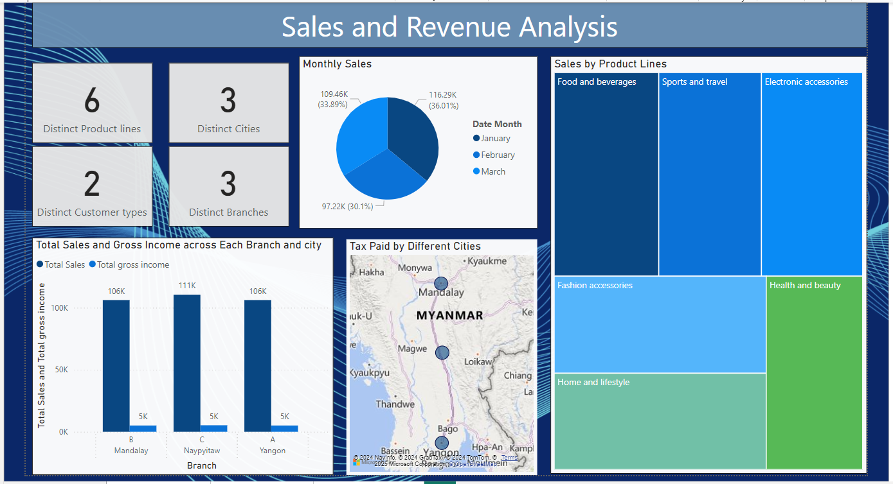
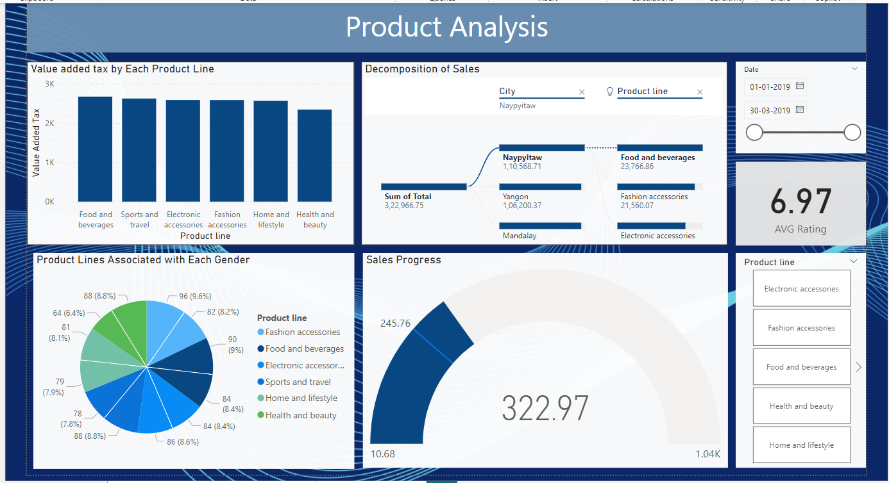
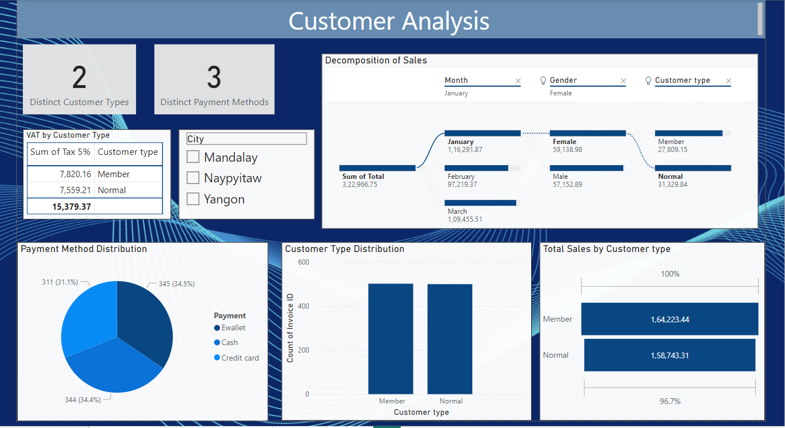

# **Amazon Sales and Customer Insights Dashboard**

This repository contains a Power BI project designed to analyze sales, customer behavior, and product performance using transactional data. The goal of the project is to derive actionable insights and present them through interactive and visually appealing dashboards.

---

## **Project Overview**

This project involves analyzing a dataset with sales transactions across different branches, cities, and product lines. The analysis focuses on:
1. **Product Analysis**: Evaluating the performance of product lines.
2. **Sales Analysis**: Understanding sales trends across branches, cities, and time periods.
3. **Customer Analysis**: Analyzing customer behavior, preferences, and demographics.

The insights are visualized using Power BI to enable decision-makers to explore the data interactively.

---

## **Key Features**

- **Interactive Dashboards**: 
  - Analyze total sales, revenue trends, and customer demographics.
  - Drill-down capabilities by branch, city, and product line.
  
- **Insightful Metrics**:
  - Top-performing product lines by revenue and VAT.
  - Customer preferences by payment methods and gender.
  - Sales distribution across time, cities, and branches.

- **Custom Analysis**:
  - Classification of product lines as "Good" or "Bad" based on sales.
  - Identification of peak sales times and days.

---

## **Dataset Description**

The dataset contains the following key attributes:
- **Transaction Details**: Invoice ID, branch, city, product line, date, and time.
- **Sales Metrics**: Total sales, VAT, gross income, and cost of goods sold (COGS).
- **Customer Demographics**: Gender and customer type.
- **Payment Information**: Payment methods used in transactions.
- **Ratings**: Customer ratings for each transaction.

---

## **Analysis Breakdown**

### **1. Product Analysis**
- Count of distinct product lines.
- Product lines with the highest sales, revenue, and VAT.
- Average ratings for each product line.
- Classification of product lines based on sales performance.

### **2. Sales Analysis**
- Revenue trends by month and city.
- Peak COGS month and highest revenue city.
- Sales occurrences by time of day and weekday.
- Branch performance in terms of quantity sold.

### **3. Customer Analysis**
- Distribution of genders and payment methods.
- Revenue contribution by customer type.
- Customer types with the highest VAT payments and purchase frequency.
- Gender-wise product preferences.

---

## **Visualizations Used**

The dashboards include the following visualizations:
- **Bar Charts**: Compare revenue, VAT, and ratings across categories.
- **Pie/Donut Charts**: Analyze the share of payment methods and customer types.
- **Line Charts**: Visualize revenue and COGS trends over time.
- **Tables**: Display branch-city relationships and performance classifications.
- **Heatmaps**: Show sales occurrences by time and weekday.
- **Scatter Plots**: Analyze customer ratings by time.

---

## **How to Use**

1. Clone this repository:
   ```bash
   git clone https://github.com/Saisrikar-Kokku/Amazon-Sales-Dashboard-PowerBI
   ```
2. Open the Power BI file (`Amazon-Sales-Dashboard.pbix`) using Power BI Desktop.
3. Ensure that the dataset (`Amazon.csv`) is in the specified file path.
4. Refresh the data to load the dataset into the dashboard.
5. Explore the interactive visuals to gain insights.

---

## **Technologies Used**

- **Tools**: Power BI Desktop
- **Languages**: DAX (Data Analysis Expressions) for custom calculations
- **Dataset Source**: CSV file containing transactional data

---

## **Screenshots**





---

## **License**

This project is licensed under the  License. You can you and Fork as well

---

## **Contributors**

- **Saisrikar-Kokku**: BTech 2nd-year student passionate about data visualization and analytics.
- **Profile** :https://github.com/Saisrikar-Kokku
- **Email** : Saisrikarkokku7674@gmail.com